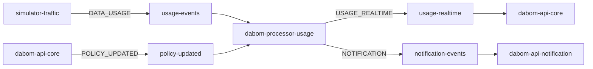

# lib-kafka

> DABOM 프로젝트 공용 Kafka 메시징 라이브러리

| 항목 | 값 |
|---|---|
| Artifact | `com.github.da-bom:lib-kafka` |
| 현재 버전 | `1.0.1` |
| Java | 21 |
| Spring Boot | 3.4.0 |
| 배포 | JitPack |

---

## 1. 목적

DABOM 마이크로서비스에서 반복되는 Kafka 관련 코드를 하나의 공통 모듈로 통합한다.

이 라이브러리가 제공하는 것:

- **Kafka Producer / Consumer 자동 설정** - 팩토리, 템플릿, 리스너 컨테이너를 표준 설정으로 구성
- **이벤트 엔벨로프** - 모든 메시지를 `EventEnvelope<T>` 포맷으로 통일
- **계약 상수** - 토픽명, 이벤트 타입, 컨슈머 그룹을 코드 레벨 상수로 관리
- **예외 분류 & 에러 핸들링** - 예외 타입별 retry / ignore / DLQ 자동 라우팅
- **운영 메트릭** - Micrometer 기반 producer/consumer 성공률, 지연시간, DLT 카운트

이 라이브러리가 제공하지 않는 것:

- Outbox polling / 상태 전이 / 스케줄링
- 서비스 고유 비즈니스 로직
- Kafka 클러스터 프로비저닝

---

## 2. 패키지 구조

```
com.dabom.messaging.kafka
├── autoconfigure/             Kafka 빈 자동 설정
│   ├── KafkaConfig                Producer/Consumer Factory, KafkaTemplate, ListenerContainerFactory
│   └── KafkaErrorHandlerConfig    CommonErrorHandler, DLT Publisher, ExceptionClassifier
├── contract/                  메시징 계약 상수
│   ├── KafkaTopics                토픽명
│   ├── KafkaEventTypes            이벤트 타입 문자열
│   └── KafkaConsumerGroups        컨슈머 그룹 ID
├── error/                     예외 분류 & 도메인 예외
│   ├── KafkaExceptionClassifier   예외 → 액션 매핑
│   ├── KafkaMessageProcessingException
│   ├── NonRetryableKafkaMessageProcessingException
│   ├── KafkaMessageDeserializationException
│   ├── KafkaErrorAction           RETRY / IGNORE / DLQ
│   ├── KafkaErrorCode             분류 코드 enum
│   └── KafkaErrorDecision         (action, code) 쌍
├── event/
│   ├── dto/                   페이로드 레코드
│   │   ├── EventEnvelope<T>       공통 메시지 래퍼
│   │   ├── notification/          NotificationPayload, NotificationType, NotificationEventSupport
│   │   ├── policy/                PolicyUpdatedPayload
│   │   └── usage/                 UsagePayload, UsageRealtimePayload
│   ├── consumer/              소비 인터페이스
│   │   └── KafkaEventConsumer<T>
│   ├── publisher/             발행 인터페이스
│   │   ├── KafkaEventPublisher
│   │   └── DefaultKafkaEventPublisher
│   └── KafkaEventMessageSupport   JSON 파싱, eventType 필터링, 직렬화
├── metrics/                   Micrometer 메트릭
│   ├── KafkaMetrics               카운터/타이머 정의
│   ├── KafkaMetricTagSanitizer    태그 정규화
│   ├── KafkaEventMetadataExtractor
│   ├── consumer/
│   │   └── KafkaMetricsRecordInterceptor
│   └── producer/
│       └── KafkaMetricsProducerListener
└── support/
    └── KafkaLogSanitizer          로그 인젝션 방지
```

---

## 3. 핵심 추상화

### 3-1. EventEnvelope\<T\>

모든 Kafka 메시지의 래퍼 레코드. Jackson 다형성 역직렬화를 지원한다.

```java
public record EventEnvelope<T>(
    String    eventId,     // UUID
    String    eventType,   // KafkaEventTypes 상수값
    LocalDateTime timestamp,
    T         payload
)
```

팩토리:

```java
EventEnvelope<UsagePayload> envelope = EventEnvelope.of("DATA_USAGE", payload);
// eventId = UUID.randomUUID(), timestamp = LocalDateTime.now()
```

Jackson `@JsonTypeInfo` 매핑:

| eventType 값 | payload 타입 |
|---|---|
| `DATA_USAGE` | `UsagePayload` |
| `POLICY_UPDATED` | `PolicyUpdatedPayload` |
| `USAGE_REALTIME` | `UsageRealtimePayload` |
| `NOTIFICATION` | `NotificationPayload` |

Wire format 예시:

```json
{
  "eventId": "a1b2c3d4-...",
  "eventType": "NOTIFICATION",
  "timestamp": "2026-03-20T14:30:00",
  "payload": {
    "familyId": 1,
    "customerId": 42,
    "type": "THRESHOLD_ALERT",
    "title": "데이터 경고",
    "message": "잔여량이 10% 남았습니다.",
    "data": { "thresholdPercent": 10 }
  }
}
```

### 3-2. 페이로드 레코드

| 레코드 | 필드 | 용도 |
|---|---|---|
| `UsagePayload` | familyId, customerId, appId, bytesUsed, metadata | 원본 사용량 이벤트 |
| `UsageRealtimePayload` | familyId, customerId, usedBytes, limitBytes, usagePercent, metadata | 실시간 사용량 스냅샷 |
| `PolicyUpdatedPayload` | familyId, policyKey, policyValue, activatedAt, active | 정책 변경 이벤트 |
| `NotificationPayload` | familyId, customerId, type, title, message, data | 알림 이벤트 (customerId=null이면 가족 전체 브로드캐스트) |

### 3-3. NotificationType

13종의 알림 타입 enum. `NotificationEventSupport.resolveTitle(type)`로 한글 제목을 얻을 수 있다.

| enum | resolveTitle 반환값 |
|---|---|
| `QUOTA_UPDATED` | 데이터 잔여량 갱신 |
| `THRESHOLD_ALERT` | 데이터 경고 |
| `CUSTOMER_BLOCKED` | 데이터 차단 |
| `CUSTOMER_UNBLOCKED` | 데이터 차단 해제 |
| `POLICY_CHANGED` | 정책 변경 |
| `MISSION_CREATED` | 미션 생성 |
| `REWARD_REQUESTED` | 보상 요청 |
| `REWARD_APPROVED` | 보상 승인 |
| `REWARD_REJECTED` | 보상 거절 |
| `APPEAL_CREATED` | 이의제기 접수 |
| `APPEAL_APPROVED` | 이의제기 승인 |
| `APPEAL_REJECTED` | 이의제기 거절 |
| `EMERGENCY_APPROVED` | 긴급 쿼터 승인 |

---

## 4. 메시징 계약

### 4-1. 토픽

| 상수 | 토픽명 | Producer | Consumer |
|---|---|---|---|
| `KafkaTopics.USAGE_EVENTS` | `usage-events` | simulator-traffic | dabom-processor-usage |
| `KafkaTopics.POLICY_UPDATED` | `policy-updated` | dabom-api-core | dabom-processor-usage |
| `KafkaTopics.USAGE_REALTIME` | `usage-realtime` | dabom-processor-usage | dabom-api-core |
| `KafkaTopics.NOTIFICATION` | `notification-events` | dabom-processor-usage / 배치 | dabom-api-notification |

### 4-2. 이벤트 타입

| 상수 | 값 | 연결 페이로드 |
|---|---|---|
| `KafkaEventTypes.DATA_USAGE` | `DATA_USAGE` | `UsagePayload` |
| `KafkaEventTypes.POLICY_UPDATED` | `POLICY_UPDATED` | `PolicyUpdatedPayload` |
| `KafkaEventTypes.USAGE_REALTIME` | `USAGE_REALTIME` | `UsageRealtimePayload` |
| `KafkaEventTypes.NOTIFICATION` | `NOTIFICATION` | `NotificationPayload` |

### 4-3. 컨슈머 그룹

| 상수 | 값 | 서비스 |
|---|---|---|
| `KafkaConsumerGroups.DABOM_PROCESSOR_USAGE_MAIN` | `dabom-processor-usage-main-group` | dabom-processor-usage |
| `KafkaConsumerGroups.DABOM_PROCESSOR_USAGE_POLICY` | `dabom-processor-usage-policy-group` | dabom-processor-usage |
| `KafkaConsumerGroups.DABOM_API_CORE_REALTIME` | `dabom-api-core-realtime-group` | dabom-api-core |
| `KafkaConsumerGroups.DABOM_NOTIFICATION_SENDER` | `dabom-notification-sender-group` | dabom-api-notification |

### 4-4. 처리 흐름



---

## 5. 자동 설정 (Auto-Configuration)

라이브러리가 컴포넌트 스캔되면 아래 빈이 자동 등록된다.

### 5-1. Producer 설정 (`KafkaConfig`)

| 빈 | 설정 |
|---|---|
| `ProducerFactory<String, String>` | StringSerializer, **acks=all**, **enable.idempotence=true** |
| `KafkaTemplate<String, String>` | observation 활성화, 메트릭 리스너 부착 |

### 5-2. Consumer 설정 (`KafkaConfig`)

| 빈 | 설정 |
|---|---|
| `ConsumerFactory<String, String>` | `ErrorHandlingDeserializer` 래핑 (poison pill 방어) |
| `ConcurrentKafkaListenerContainerFactory` | observation 활성화, 메트릭 인터셉터, 공통 에러 핸들러 |

### 5-3. 에러 핸들러 (`KafkaErrorHandlerConfig`)

| 빈 | 역할 |
|---|---|
| `CommonErrorHandler` | `DefaultErrorHandler` + exponential backoff + DLT 라우팅 |
| `KafkaExceptionClassifier` | 예외 체인을 분석하여 (action, code) 결정 |
| DLT Producer | `{원본토픽}.DLT`로 실패 메시지 전송, `x-error-code`/`x-error-action` 헤더 포함 |

### 5-4. 기타

| 빈 | 역할 |
|---|---|
| `KafkaEventMessageSupport` | JSON 파싱, eventType 필터링, 직렬화/역직렬화 |
| `DefaultKafkaEventPublisher` | `KafkaEventPublisher` 구현체 |
| `KafkaMetrics` | Micrometer 카운터/타이머 정의 |
| `KafkaMetricsProducerListener` | producer 성공/실패 메트릭 |
| `KafkaMetricsRecordInterceptor` | consumer 처리시간, producer-to-consumer 지연 메트릭 |
| `KafkaLogSanitizer` | 로그 인젝션 방지 (`\r\n\t` 치환, 128자 절단) |

---

## 6. 내부 로직

### 6-1. 발행 흐름

```
Application
  └─ KafkaEventPublisher.publish(topic, eventType, payload)
       └─ EventEnvelope.of(eventType, payload)        ← UUID, timestamp 자동 생성
            └─ KafkaEventMessageSupport.serialize()    ← ObjectMapper → JSON String
                 └─ KafkaTemplate.send(topic, json)
                      └─ KafkaMetricsProducerListener  ← 성공/실패 카운터, 지연 타이머
```

### 6-2. 소비 흐름 (2-pass 역직렬화)

무관한 이벤트에 대한 전체 역직렬화 비용을 방지하기 위해 **2-pass 전략**을 사용한다.

```
ConsumerRecord<String, String>
  │
  ├─ Pass 1: readTree(json) → JsonNode
  │    └─ extractEventType(node)
  │         └─ eventType이 기대값과 불일치? → warn 로그, return (skip)
  │
  └─ Pass 2: eventType 일치 시
       └─ convertToEnvelope(node, TypeReference<EventEnvelope<T>>)
            └─ KafkaEventConsumer.handle(envelope, recordKey)
```

예외 발생 시 분류기가 액션을 결정한다:

```
Exception 발생
  └─ KafkaExceptionClassifier.classify(exception)
       └─ cause chain 순회하며 첫 매칭 규칙 적용
            ├─ RETRY  → exponential backoff 후 재시도
            ├─ IGNORE → skip (warn 로그 + 메트릭)
            └─ DLQ    → {topic}.DLT로 전송
```

### 6-3. 예외 분류 규칙

| 예외 | 액션 | 코드 |
|---|---|---|
| `KafkaMessageDeserializationException` | DLQ | `DESERIALIZATION_FAILED` |
| `DeserializationException` | DLQ | `DESERIALIZATION_FAILED` |
| `SerializationException` | DLQ | `DESERIALIZATION_FAILED` |
| `IllegalArgumentException` | IGNORE | `INVALID_EVENT` |
| `TimeoutException` | RETRY | `TRANSIENT_NETWORK` |
| `SocketTimeoutException` | RETRY | `TRANSIENT_NETWORK` |
| `RetriableException` | RETRY | `TRANSIENT_NETWORK` |
| `TransientDataAccessException` | RETRY | `TRANSIENT_DB` |
| `KafkaMessageProcessingException` | RETRY | `PROCESSING_FAILED` |
| `NonRetryableKafkaMessageProcessingException` | DLQ | `NON_RETRYABLE_PROCESSING_FAILED` |
| 기타 모든 예외 | DLQ | `UNKNOWN` |

분류기는 **cause chain 전체**를 순회한다. 래핑된 예외도 올바르게 분류된다.

---

## 7. 설정 레퍼런스

| 프로퍼티 | 기본값 | 설명 |
|---|---|---|
| `spring.kafka.bootstrap-servers` | `localhost:9092` | Kafka 브로커 주소 |
| `app.kafka.error-handler.retry.max-attempts` | `2` | 최대 재시도 횟수 |
| `app.kafka.error-handler.retry.initial-interval-ms` | `1000` | 첫 재시도 대기 (ms) |
| `app.kafka.error-handler.retry.multiplier` | `2.0` | backoff 배수 |
| `app.kafka.error-handler.retry.max-interval-ms` | `10000` | 최대 대기 간격 (ms) |

---

## 8. 메트릭 레퍼런스

### Producer 메트릭

| 메트릭 | 타입 | 태그 |
|---|---|---|
| `kafka.producer.send.success.count` | Counter | topic, eventType, result |
| `kafka.producer.send.error.count` | Counter | topic, eventType, result |
| `kafka.producer.send.latency` | Timer (percentile) | topic, eventType |

### Consumer 메트릭

| 메트릭 | 타입 | 태그 |
|---|---|---|
| `kafka.consumer.success.count` | Counter | topic, group, eventType |
| `kafka.consumer.invalid_event.count` | Counter | topic, group, eventType |
| `kafka.consumer.retryable_error.count` | Counter | topic, group, eventType |
| `kafka.consumer.dlt.count` | Counter | topic, group, eventType |
| `kafka.consumer.dedup_hit.count` | Counter | topic, group, eventType |
| `kafka.consumer.processing.time` | Timer (percentile) | topic, group, eventType |
| `kafka.consumer.producer_to_consumer.latency` | Timer (percentile) | topic, group, eventType |

eventType 태그는 `KafkaMetricTagSanitizer`가 정규화한다. 허용되지 않은 값은 `UNKNOWN` 또는 `OTHER`로 치환되어 메트릭 폭발을 방지한다.

---

## 9. 사용 방법

### 9-1. 의존성 추가

```gradle
repositories {
    mavenCentral()
    maven { url 'https://jitpack.io' }
}

dependencies {
    implementation 'com.github.da-bom:lib-kafka:v1.0.1'
}
```

### 9-2. 컴포넌트 스캔

애플리케이션 루트 패키지가 `com.dabom` 하위가 아니면 명시적으로 스캔 범위를 추가한다.

```java
@SpringBootApplication(scanBasePackages = {
    "com.myservice",
    "com.dabom.messaging.kafka"
})
public class MyApplication {}
```

### 9-3. 이벤트 발행

```java
@Service
@RequiredArgsConstructor
public class UsageEventPublishService {
    private final KafkaEventPublisher kafkaEventPublisher;

    public void publish(UsageRealtimePayload payload) {
        kafkaEventPublisher.publish(
                KafkaTopics.USAGE_REALTIME,
                KafkaEventTypes.USAGE_REALTIME,
                payload);
    }
}
```

알림 발행:

```java
@Service
@RequiredArgsConstructor
public class NotificationPublishService {
    private final KafkaEventPublisher kafkaEventPublisher;

    public void publish(NotificationPayload payload) {
        kafkaEventPublisher.publish(
                KafkaTopics.NOTIFICATION,
                NotificationEventSupport.toEnvelope(payload));
    }
}
```

### 9-4. 이벤트 소비 (방법 A: consumeByEventType 람다)

```java
@Component
@RequiredArgsConstructor
public class UsageRealtimeListener {
    private final KafkaEventMessageSupport kafkaEventMessageSupport;
    private final UsageRealtimeService usageRealtimeService;

    @KafkaListener(
            topics = KafkaTopics.USAGE_REALTIME,
            groupId = KafkaConsumerGroups.DABOM_API_CORE_REALTIME)
    public void consume(ConsumerRecord<String, String> record) {
        kafkaEventMessageSupport.consumeByEventType(
                record,
                KafkaEventTypes.USAGE_REALTIME,
                new TypeReference<EventEnvelope<UsageRealtimePayload>>() {},
                (envelope, key) -> usageRealtimeService.handle(envelope.payload(), key));
    }
}
```

### 9-5. 이벤트 소비 (방법 B: KafkaEventConsumer 구현)

리스너를 얇게 유지하고 처리 책임을 분리하는 패턴:

```java
@Component
@RequiredArgsConstructor
public class UsageRealtimeConsumer implements KafkaEventConsumer<UsageRealtimePayload> {
    private final UsageRealtimeService usageRealtimeService;

    @Override
    public String eventType() {
        return KafkaEventTypes.USAGE_REALTIME;
    }

    @Override
    public TypeReference<EventEnvelope<UsageRealtimePayload>> typeReference() {
        return new TypeReference<>() {};
    }

    @Override
    public void handle(EventEnvelope<UsageRealtimePayload> envelope, String recordKey) {
        usageRealtimeService.handle(envelope.payload(), recordKey);
    }
}
```

리스너에서 위임:

```java
@KafkaListener(topics = KafkaTopics.USAGE_REALTIME,
               groupId = KafkaConsumerGroups.DABOM_API_CORE_REALTIME)
public void consume(ConsumerRecord<String, String> record) {
    usageRealtimeConsumer.consume(record, kafkaEventMessageSupport);
}
```

### 9-6. 예외 사용 규칙

| 상황 | 사용할 예외 | 분류 결과 |
|---|---|---|
| JSON 파싱 / 역직렬화 실패 | `KafkaMessageDeserializationException` | DLQ |
| 일시 장애 (네트워크, DB) | `KafkaMessageProcessingException` | RETRY |
| 재시도 무의미한 비즈니스 실패 | `NonRetryableKafkaMessageProcessingException` | DLQ |
| 계약 위반, 입력 검증 실패 | `IllegalArgumentException` | IGNORE |

---

## 10. 운영 / 버전 정책

- 태그 버전 고정 사용: `v1.0.1` 형태
- 기존 태그 재사용 금지 - 변경 시 반드시 새 태그 발행
- 브레이킹 변경은 메이저 버전 업
- 패치/기능 추가는 마이너/패치 버전으로 새 태그 발행

---

## 11. 버전별 변경 이력

### v1.0.1
- 버전 범프

### v1.0.0
- notification 계약을 `NotificationType` + 단일 `NotificationPayload` 구조로 단순화
- `EventEnvelope.subType` 제거
- `usage-persist` 토픽 계약 제거 (`USAGE_PERSIST`, `UsagePersistPayload`, persistence consumer group)
- `NotificationEventSupport.resolveTitle()` 헬퍼 추가

### v0.5.0
- `KafkaTopics`, `KafkaEventTypes`, `KafkaConsumerGroups` 추가
- `NotificationSubTypes`, `NotificationEventSupport` 추가

### v0.4.0
- 패키지 구조를 `com.dabom.messaging.kafka` 기준으로 재정리
- `KafkaEventPublisher`, `DefaultKafkaEventPublisher`, `KafkaEventConsumer<T>` 추가
- tracing 지원 제거

### v0.3.x 이하
- 초기 Kafka 설정, 이벤트 envelope, 에러 처리, 메트릭 기능 제공

---

## 12. JitPack 장애 시 fallback

```bash
# 라이브러리 프로젝트에서
./gradlew clean publishToMavenLocal -x test
```

```gradle
// 소비 프로젝트에서
repositories {
    mavenLocal()
    mavenCentral()
    maven { url 'https://jitpack.io' }
}
```

---

## 13. 상세 문서

| 문서 | 내용 |
|---|---|
| [usage-guide](docs/usage-guide.md) | 설치부터 발행/소비까지 단계별 가이드 |
| [kafka-architecture-overview](docs/kafka-architecture-overview.md) | 토픽 구조, 컨슈머 그룹, 처리 흐름 |
| [error-handling-policy](docs/error-handling-policy.md) | 예외 분류 규칙, retry/DLT 정책 |
| [operations-guide](docs/operations-guide.md) | 메트릭 해석, DLT 기준, 운영 체크포인트 |
| [migration-guide](docs/migration-guide.md) | 기존 서비스에서 lib-kafka로 전환하는 절차 |
