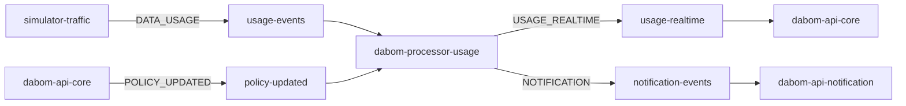

# Kafka Architecture Overview

이 문서는 `lib-kafka`가 현재 DABOM 프로젝트에서 어떤 메시징 계약을 제공하는지 설명한다.
기준 버전은 `v1.0.0`이다.

## 1. 목적

`lib-kafka`는 다음을 공통화하기 위한 라이브러리다.

- Kafka producer / consumer 기본 설정
- 공통 이벤트 포맷
- topic / eventType / consumer group 계약 상수
- 공통 에러 처리
- 공통 메트릭

## 2. 현재 토픽 구조

현재 기준으로 사용하는 토픽은 다음 네 가지다.

| Topic | Constant | Producer | Consumer | Purpose |
| --- | --- | --- | --- | --- |
| `usage-events` | `KafkaTopics.USAGE_EVENTS` | `simulator-traffic` | `dabom-processor-usage` | 원본 사용량 이벤트 입력 |
| `policy-updated` | `KafkaTopics.POLICY_UPDATED` | `dabom-api-core` | `dabom-processor-usage` | 정책 변경 전달 |
| `usage-realtime` | `KafkaTopics.USAGE_REALTIME` | `dabom-processor-usage` | `dabom-api-core` | 실시간 조회 반영 |
| `notification-events` | `KafkaTopics.NOTIFICATION` | `dabom-processor-usage` 또는 배치 서버 | `dabom-api-notification` | 사용자 알림 발행 |

폐기된 계약:

- `usage-persist`

## 3. 현재 consumer group 계약

| Consumer Group | Constant | Service | Purpose |
| --- | --- | --- | --- |
| `dabom-processor-usage-main-group` | `KafkaConsumerGroups.DABOM_PROCESSOR_USAGE_MAIN` | `dabom-processor-usage` | 메인 usage 처리 |
| `dabom-processor-usage-policy-group` | `KafkaConsumerGroups.DABOM_PROCESSOR_USAGE_POLICY` | `dabom-processor-usage` | 정책 변경 반영 |
| `dabom-api-core-realtime-group` | `KafkaConsumerGroups.DABOM_API_CORE_REALTIME` | `dabom-api-core` | 실시간 조회 갱신 |
| `dabom-notification-sender-group` | `KafkaConsumerGroups.DABOM_NOTIFICATION_SENDER` | `dabom-api-notification` | 알림 소비 및 저장 |

## 4. 현재 event type 계약

| Event Type | Constant | Payload |
| --- | --- | --- |
| `DATA_USAGE` | `KafkaEventTypes.DATA_USAGE` | `UsagePayload` |
| `POLICY_UPDATED` | `KafkaEventTypes.POLICY_UPDATED` | `PolicyUpdatedPayload` |
| `USAGE_REALTIME` | `KafkaEventTypes.USAGE_REALTIME` | `UsageRealtimePayload` |
| `NOTIFICATION` | `KafkaEventTypes.NOTIFICATION` | `NotificationPayload` |

## 5. Notification 계약

notification은 `eventType=NOTIFICATION` 아래에서 단일 `NotificationPayload`를 사용한다.
세부 알림 종류는 envelope의 `subType`이 아니라 `NotificationPayload.type`으로 구분한다.

`NotificationType`:

- `THRESHOLD_ALERT`
- `BLOCKED`
- `UNBLOCKED`
- `POLICY_CHANGED`
- `MISSION_CREATED`
- `REWARD_REQUESTED`
- `REWARD_APPROVED`
- `REWARD_REJECTED`
- `APPEAL_CREATED`
- `APPEAL_APPROVED`
- `APPEAL_REJECTED`
- `EMERGENCY_APPROVED`

## 6. 공통 메시지 포맷

이 라이브러리는 `EventEnvelope<T>`를 기본 메시지 포맷으로 사용한다.

필드:

- `eventId`
- `eventType`
- `timestamp`
- `payload`

의도:

- topic과 메시지 의미를 분리
- 공통 메타데이터 통일
- 공통 직렬화 / 역직렬화 지원

## 7. 현재 처리 흐름



비고:

- notification 발행 자체는 서비스 직접 발행 또는 Outbox 기반 배치 발행 구조를 모두 수용한다.
- `lib-kafka`는 토픽 계약과 공통 런타임 동작을 제공하고, Outbox polling은 서비스 또는 배치 책임이다.

## 8. 패키지 구조

```text
com.dabom.messaging.kafka
|- autoconfigure
|- contract
|- error
|- event
|  |- consumer
|  |- dto
|  |  |- notification
|  |  |- policy
|  |  `- usage
|  `- publisher
|- metrics
`- support
```

핵심 의도:

- `contract`: 문자열 계약 상수
- `event`: 이벤트 envelope, payload, publisher/consumer 확장 포인트
- `error`: 공통 예외 분류
- `metrics`: producer/consumer 메트릭
- `autoconfigure`: 기본 Kafka wiring

## 9. 관련 문서

- 사용 방법: [usage-guide.md](./usage-guide.md)
- 에러 처리: [error-handling-policy.md](./error-handling-policy.md)
- 운영 기준: [operations-guide.md](./operations-guide.md)
- 마이그레이션: [migration-guide.md](./migration-guide.md)
